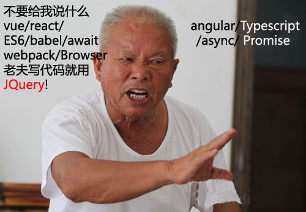

# DOM
****
- ## 前端技术的进化
  虽然我是17年6月份开始学习的前端, 那个时候我只知道前端的工作差不多就是可以制作网页之类的, 而语言用的是javascript, 可能算我来的不是时候, 这一年或许是近几年对新人来说并不友好, 对那些老人也不算太友好, 因为前端的发展太过迅速, 尤其是nodejs的出现, 把js这门前端语言跑在了后端的领域, 网上的评论说nodejs的出现时前端大爆炸, 把前端从刀耕火种走上了工业化的转变, 着其实最恰当不过了, 那么今天就来来说说就DOM方面 前端发生了那些变化
  * ### 原生版本的dom操作
    在jquery之前, 这也算是js发展比较低潮的阶段, js的作用并不像现在这样巨大, 只是当成一种表单的提交, 毕竟一个7天就诞生的语言, 存在着诸多不好的部分,至今还在影响着我么, 网页变得越来越复杂, 不仅仅局限于表单的提交, 我们需要来操作网页中的DOM节点, 来可控的改变样式或者数据那那时候我们是怎么做的呢
    ```bash
    let oDiv = document.getElementByClassName('item')[0]
    oDiv.innerHTML = 'david'
    ```
    光光一个获取元素就要记上那么长串的单词, 获取你英文很好, 可以记得住, 但是我刚学的时候对于写驼峰式命名法很难受, 总之很不爽, 现在的编译器很智能, 能帮助我们解决这样的问题, 但是随着业务的复杂, 这终究不是一个好的解决办法
  * ### jQuery的出现
      或许你看过这张图
      几年前会jQuery就可以找一个不错的前端工作了, 以至于现在仍然有许多人抱着jquery吃饭, 的确jQuery给我们带来了许多简便, 我们不用像原生那样`document.getElementsByClassName(selector)`烦人的代码, 仅仅一行`$(selector)`就可以了,来看看juqery如何实现上面的例子吧
      ```bash
      $(function() {
        $('.item').html(13)
      })
      ```
      这种链式编程能让我们写代码非常的爽, 因为其内部每次返回都会把这个jquery对象返回出来,
      很遗憾我感觉我的jquery用的非常不好, 虽然我看过那本**锋利的jQuery**但是很早以前, 但我认为掌握它并不是上面男难事, 因为jQuery真的就是封装好了API而你直接用就行了, 你所需要的就是一本小册子, 在你不会的时候查查文档,
  * ### MV*框架的出现
    我不太清楚这个词是什么时候出现在前端的, 但我知道这个词之前是出现在后端的, 这种设计模式让表现层和数据层分离, 我们更多关注的式自己应该关注的部分, 比如业务的逻辑, 而不应该是因为什么数据以某某方式来传输, 或者数据以什么形式来展现, 前端的MV*框架有很多, 最著名的也就目前的Angular, React, Vue了, 来看看Vue是如何实现上面的功能的吧
    ```bash
    <div id="app">{{msg}}</div>
    new Vue({
      el:'#app',
      data: {
        msg: 13
      }
    })
    ```
    也许你并不太懂js, 但这类对象的方式你肯定知道,知道css那么更好, 你知道选择器了, 那么这段代码你就知道要表达什么意思, 怎么样, 前端的进化脚步是不是可以用这种对于DOM元素获取的简易成都来映射出来, 从刚开始的**原生JS -> $() -> null**
- ## 我们应该以什么心态来学习
  * ### 追求新技术, 但原生不能放
    这是我认为所应该遵守的规则, 我们不能不去使用那些优秀的框架库, 而用原生js,因为这样会效率低下, 同样的也不能只追求那些新技术, 而抛弃了原生, 就拿Vue来说吧, 新技术真是太多了, 先有饿了么开源的Element-ui库, 后又美团大佬们开源的以写Vue的方式解决微信小程序的mpvue(我第一次学小程序就感觉小程序跟Vue很相似, 但是后来发现小程序不能双线绑定), 服务端渲染(ssr)可以使用Nuxt.js, 而想要像React Native那样你可以期待淘宝团队的Weex, 技术不断的更新, 而且会越来越多, 但这些新技术的背后都是一样的, 都是js, 语法都是相同的, 如果你就是那种每个月拿着固定工资, 而且不会饿死的那种, 你可以不用学, 但是如果你追求上进, 想要往更高的方向发展(追求钱), 那么原生js你是怎么也跳不了的一道坎, 所以请克服它, 当你真正掌握了后, 再去看看那些新技术的源码, 你会发现, 其实也就那样, 当然了我也还在学习, 我的原生也很差, 导致一个Vue的双向绑定原理看了好几遍, 还是模模糊糊的, 先就说到这吧, 晚上在更新一个DOM总结
